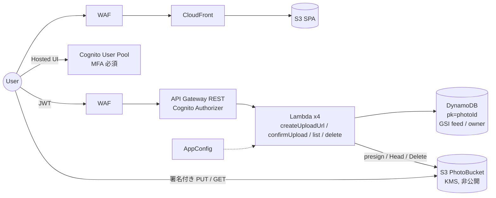
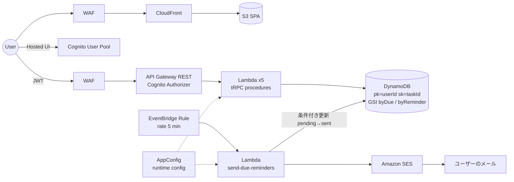
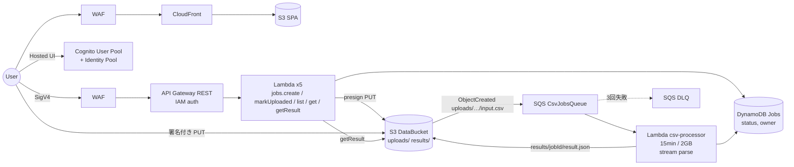
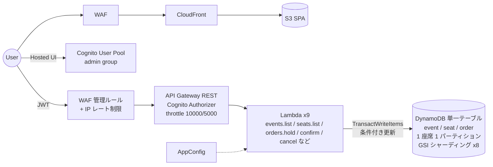

## はじめに

2026年9月、AWS の Nx 向け Generator 集 `@aws/nx-plugin`（Nx Plugin for AWS）が v1.0.0 としてリリースされました。README の冒頭には「Build full-stack AWS apps in minutes」とあり、Reactや「AI アシスタントにプロンプトを渡せば、必要な Generator を選んで組み立ててくれる」とも書かれています。

部品がこれだけ揃っていて、AI がその部品を調べて呼べるなら、ユーザーストーリーだけを渡したら、どこまで自力でアーキテクチャを決めて実装まで持っていけるのか気になったので、検証してみたという趣旨の内容になります。

そこで、Claude Code に `@aws/nx-plugin` を使える状態で、難易度の異なる 4 つのユーザーストーリーだけを渡し、
何を選び、何を選ばず、どこで人間の判断が必要になったかを記録してみました。この記事はその検証記録です。

## @aws/nx-plugin とは

[`@aws/nx-plugin`](https://github.com/awslabs/nx-plugin-for-aws)（Nx Plugin for AWS）は、awslabs が公開している Nx 用のプラグインで、Nx モノレポの中に「アプリケーションコード＋それをデプロイするための IaC」をセットで生成する Generator 群です。2026年9月7日に v1.0.0 がリリースされています。

検証時点（v1.0.0）で公開されている主な Generator は次のとおりです（`nx list @aws/nx-plugin` の出力から、hidden でないものを抜粋）。

| Generator | 生成されるもの |
| --- | --- |
| `ts#website` | React（Vite）の静的サイト。インフラは S3 + CloudFront + WAF |
| `ts#website#auth` | 既存サイトへの Cognito 認証追加（User Pool / Identity Pool / Hosted UI） |
| `ts#api` | tRPC または Smithy の API。インフラは API Gateway（REST or HTTP）+ Lambda。認証は IAM / Cognito / custom |
| `py#api` | FastAPI 版の API。同じく API Gateway + Lambda |
| `ts#dynamodb` / `py#dynamodb` | DynamoDB テーブル＋ ElectroDB（TS）によるエンティティ層 |
| `ts#rdb` / `py#rdb` | Aurora（PostgreSQL / MySQL）+ RDS Proxy + Prisma、マイグレーション用 Lambda |
| `ts#lambda-function` / `py#lambda-function` | 単体の Lambda 関数。40種類以上のイベントソーススキーマ（SQS / EventBridge / S3 / DynamoDB Stream など）を型付きで選べる |
| `ts#infra` | CDK アプリケーション本体（`packages/infra`）。Checkov によるテンプレート検査を build に組み込み |
| `terraform#project` | Terraform 版のインフラプロジェクト |
| `connection` | プロジェクト同士の接続（Website → API、API → DynamoDB など）。クライアント生成と IAM 権限付与をまとめて行う |
| `ts#agent` / `py#agent` / `ts#mcp-server` / `agentcore-*` | Strands Agent、MCP サーバ、Bedrock AgentCore 関連 |

重要なのは、この一覧に **SQS、EventBridge、SES、SNS、Step Functions、S3（単体）、ECS の Generator は存在しない** ことです。`ts#lambda-function` がイベントソースの「受け口」を型付きで用意してくれますが、キューやスケジューラといったイベントの「送り元」は、Generator の外側で CDK を手書きする必要があります。この点は後の Case 2〜4 で効いてきます。

もう一つの特徴は、AI エージェント向けの MCP サーバが同梱されていることです。`@aws/create-nx-workspace` でワークスペースを作ると、`.mcp.json`（Claude Code 用）や `.cursor/mcp.json`、`.kiro/settings/mcp.json` などに `nx-plugin-for-aws` という MCP サーバが自動登録され、次の7ツールが使えるようになります。

- `general-guidance` / `best-practices`：Nx とプラグインの使い方、セキュリティやランタイム設定に関する横断的なガイド
- `list-generators`：Generator の一覧と、それぞれの実行コマンド・オプション
- `generator-guide`：特定 Generator の詳細ガイド。`options` を渡すと、その組み合わせに関係する部分だけに絞って返してくれる
- `create-workspace-command` / `add-to-existing-project` / `upgrade-workspace`：ワークスペースの作成・導入・更新

つまり、Claude Code から見ると「どんな部品があり、どう呼べばよいか」を実行時に問い合わせられる状態になっています。

### 役割分担をはっきりさせておく

ここで強調しておきたいのは、**@aws/nx-plugin 自身はアーキテクチャを考えない** ということです。

`ts#api` を実行すれば API Gateway + Lambda が出てきますし、`ts#dynamodb` を実行すれば DynamoDB が出てきます。しかし「この要件に DynamoDB が適切か」「非同期処理にキューを挟むべきか」「二重販売を防ぐには条件付き書き込みが要るか」といった判断は、Generator の外側にあります。プラグインの公式ドキュメント（security ページ）にも、次のような趣旨のことが明記されています。

> The scope of the plugin is limited to its generators. The plugin has no knowledge of your application's business logic, data classification, threat model, or regulatory obligations. (中略) Authentication is configured, but authorization is not.

今回の検証は、この「外側の判断」を Claude Code がどこまで担えるかを見るものです。

- **アーキテクチャ判断をするのは Claude Code**
- **実装手段（定型化されたアプリ＋IaC）を提供するのが @aws/nx-plugin**

という役割分担を前提に読んでください。

## 今回やってみたいこと

通常、AWS 上にアプリケーションを作る場合は、

```
ユーザー要件
  ↓ 人間
アプリケーション設計
  ↓ 人間
AWSアーキテクチャ設計
  ↓ 人間
IaC
  ↓ 人間（最近はAI）
実装
```

という流れで、人間がかなりの部分を設計します。

一方、Claude Code のようなエージェントと @aws/nx-plugin を組み合わせると、

```
ユーザーストーリー
  ↓ Claude Code が必要なコンポーネントを判断
  ↓ Claude Code が必要なAWSサービスを判断
  ↓ Claude Code が @aws/nx-plugin の適切な Generator を選択
  ↓ Generator がアプリ＋IaC を生成、足りない部分を Claude Code が手書き
アプリケーション + インフラ
```

というところまで持っていけるのではないか、というのが今回の検証テーマです。

## 検証ルール

Claude Code には AWS サービス名も、具体的なアーキテクチャも指定しません。渡したのは次のプロンプトだけです。

```text
以下のユーザーストーリーを実現してください。
AWS上で動作するアプリケーションとして構築してください。
利用可能な場合は @aws/nx-plugin のGeneratorを優先して利用してください。
必要なアプリケーション構成とAWSリソースは、要件から判断してください。

ユーザーストーリー:
「（各ケースのユーザーストーリー）」
```

これに加えて、検証を回すための運用上の制約として、以下を「アーキテクチャ判断には影響させないでください」と断ったうえで添えています。

- 作業ディレクトリは `@aws/create-nx-workspace` で作成済み（pnpm / CDK）
- AWS アカウントへのデプロイ（`cdk deploy` / `cdk bootstrap`）は行わず、ビルド・テスト・`cdk synth` まで
- 最後に `DESIGN.md`（解釈した要件、選んだサービスと理由、使った／使わなかった Generator、手書きした部分、人間のレビューが必要な点）と `WORKLOG.md`（実行コマンドの記録）を書くこと
- 途中で質問はできないので、自分で判断して理由を残すこと

「DynamoDB を使え」「Lambda を使え」「Cognito を使え」といった指示は一切含めていません。

### 検証環境

| 項目 | 内容 |
| --- | --- |
| Claude Code | 2.1.268 |
| モデル | Claude Fable 5.1（`claude-fable-5-1`） |
| @aws/nx-plugin | 1.0.0（2026-09-07 リリース） |
| Nx | 23.2.0 |
| パッケージマネージャ / IaC | pnpm 10 / AWS CDK（aws-cdk-lib 2.268.0） |
| 実行形態 | Claude Code のサブエージェント（Agent ツール）として、ケースごとに独立した空ワークスペースで並列実行 |

一点だけ環境上の注意があります。サブエージェントは親セッションの MCP 設定を引き継がないため、ワークスペースの `.mcp.json` に登録された `nx-plugin-for-aws` MCP サーバを直接は呼べません。そこで、同じ MCP サーバを stdio 経由で叩く薄い CLI ラッパー（`node nxmcp.mjs <tool-name> '<json>'`）を用意し、「使うかどうかはあなたの判断に任せます」と伝えました。ラッパーは呼び出し履歴をファイルに残すので、「AIが Generator を調べた過程」はここから追えます。

また、ケースごとにワークスペースは完全に別で、Claude Code は他のケースの結果を知りません。4ケースは同時に走らせています。

:::message
検証途中でアカウントのセッション上限に達し、4エージェントとも約2時間半停止しました。上限解除後にそれぞれのコンテキストを保ったまま再開させています。この中断は Generator 実行後・アプリ実装中に起きており、アーキテクチャ選択には影響していません。
:::

## Case 1：画像共有アプリ

### 与えたユーザーストーリー

```text
「ユーザーとして、写真をアップロードして一覧表示し、他のユーザーと共有したい。
ログインしたユーザーだけが写真を投稿できるようにしたい。」
```

### Claude Code が解釈した要件

DESIGN.md の要件表から抜粋します。

- サインアップ／サインインが必要（Cognito User Pool、Hosted UI、セルフサインアップ有効）
- 「ログインしたユーザーだけが投稿」を、**API 全体を Cognito オーソライザーで保護し、未認証は Lambda に到達させない** と解釈
- 画像本体は **API Gateway / Lambda を通さない**（10 MB 制限と実行時間・コストの回避）。署名付き PUT URL で S3 に直接アップロードし、`confirmUpload` で登録
- 「他のユーザーと共有」を **ログイン済みユーザー全員に公開される** と解釈。特定ユーザー宛て共有、リンク共有、公開範囲設定はスコープ外と明記
- 要件にない「自分の写真は削除できる」を追加し、投稿者本人のみ許可
- 非機能として自分で設定：1 枚 10 MiB まで、JPEG/PNG/GIF/WebP/HEIC、閲覧も署名付き URL（1 時間）経由のみ、Lambda は操作ごとに分離して最小権限、写真バケットとテーブルは `RETAIN`

「共有」の解釈をどう置いたかを明示的に書いていた点は良かったと思います。ここは人によって「リンクを知っている人に公開」とも「特定ユーザーに共有」とも読めるところです。

### 選択した AWS サービス

| 役割 | 選択されたもの | 選択理由（DESIGN.md より要約） |
| --- | --- | --- |
| Frontend | S3 + CloudFront（React + shadcn/ui + Tailwind） | `ts#website` の既定。「ギャラリーの自由なグリッドレイアウトには Tailwind + shadcn が扱いやすい」 |
| API | API Gateway REST + Lambda（tRPC、操作ごとに Lambda 分離） | `ts#api` の既定。フロントと型を共有できる tRPC。REST は WAF・アクセスログ付きで Cognito オーソライザーが使える |
| Authentication | Cognito User Pool + Identity Pool + Hosted UI | `ts#website#auth` が標準で構成。API Gateway と直結でき JWT 検証を自前実装しなくてよい |
| Database | DynamoDB（ElectroDB、GSI 2 本：全体フィード / 投稿者別） | 一覧と投稿者別一覧を GSI で Query できる。Aurora は過剰 |
| Storage | **S3（PhotoBucket、手書き）**：KMS CMK、バージョニング、非公開、CORS、ライフサイクル | 画像はオブジェクトストレージが最適。署名付き URL で API を経由せず転送 |
| Upload 方式 | 署名付き PUT URL（5 分）→ `confirmUpload` で HeadObject 検証 | Base64 で API 経由は 10 MB 制限・WAF の Body 制限に抵触。S3 イベント→Lambda 登録の非同期方式は「タイトル・説明を確定しづらい」ため見送り |
| CDN | CloudFront（SPA 配信のみ）。**画像配信には CloudFront を使わず S3 署名付き GET URL** | 「CloudFront + 署名付き Cookie は効率的だがキーペア管理が必要。まずは S3 署名付き URL で実現し、規模拡大時の改善候補」 |
| Async | なし | ― |
| Security | WAF（API / CloudFront）、KMS、Cognito **MFA 必須（Generator 既定のまま）** | 「写真共有アプリとしては重い可能性があるが、セキュア既定を崩さずレビュー判断に委ねた」 |

### @aws/nx-plugin で利用した Generator

MCP ラッパーの呼び出し順は次のとおりです。

```text
tools
general-guidance
list-generators
best-practices {"pages":["workspace","typescript-project","security","runtime-config","local-development"]}
generator-guide ts#infra
generator-guide ts#dynamodb
generator-guide ts#website {"ux":"cloudscape","framework":"react"}
generator-guide ts#website#auth
generator-guide ts#api {"framework":"trpc","auth":"cognito","infra":"rest-lambda"}
generator-guide connection {"sourceType":"ts#trpc-api","targetType":"ts#dynamodb"}
generator-guide connection {"sourceType":"ts#react-website","targetType":"ts#trpc-api"}
```

面白いのは、`ts#website` のガイドは `ux=cloudscape` で引いたのに、実行時は `--ux=shadcn` を選んでいる点です。ガイドを読んだうえで、ギャラリー UI には shadcn の方が向くと判断を変えたようです。

実行した Generator は 7 回でした。

```bash
pnpm nx g @aws/nx-plugin:ts#infra --name=infra
pnpm nx g @aws/nx-plugin:ts#website --name=website --framework=react --ux=shadcn --infra=cloudfront-s3
pnpm nx g @aws/nx-plugin:ts#website#auth --project=website --allowSignup=true
pnpm nx g @aws/nx-plugin:ts#api --name=photo-api --framework=trpc --auth=cognito \
  --infra=rest-lambda --integrationPattern=isolated
pnpm nx g @aws/nx-plugin:ts#dynamodb --name=photo-db --framework=electrodb --infra=dynamodb
pnpm nx g @aws/nx-plugin:connection --sourceProject=website --targetProject=photo-api
pnpm nx g @aws/nx-plugin:connection --sourceProject=photo-api --targetProject=photo-db
```

写真を置く S3 バケットには対応する Generator がないため、`application-stack.ts` に CDK で直接書いていました（KMS キー、バージョニング、不完全マルチパートの中断、旧バージョンの 30 日削除、CORS、`RETAIN`）。

選ばなかった Generator として、`smithy`、`http-lambda`、`integrationPattern=shared`（操作ごとに S3/DynamoDB 権限を分けたかったため）、`ts#rdb`、`ts#lambda-function`（S3 イベント連携を採用しなかったため）、`cloudscape` が理由付きで挙がっていました。

### 最終的な AWS アーキテクチャ

`cdk synth` の結果（Application スタック 108 リソース + WAF 用スタック）から起こしています。



AWS に慣れた人が思い浮かべる S3 / CloudFront / Cognito / Lambda / API Gateway / DynamoDB はすべて出てきましたが、**画像配信には CloudFront を使っていません**。一覧 API が写真ごとに S3 の署名付き GET URL を返す方式です。

### AI がうまく判断したところ

- **画像を API に通さない**：API Gateway の 10 MB 制限と Lambda のコストを理由に、署名付き URL で S3 直接アップロードにしていました。要件には書いていない、しかし実務では最初に決める設計判断です。
- **アップロード確定の 3 段階検証**：クライアント側のサイズ・種別チェック、API 入力スキーマ、`confirmUpload` での `HeadObject`（実際の Content-Type とサイズ）の 3 段階で検証し、不正なら S3 から削除して拒否しています。
- **S3 キーに所有者を埋め込む**：キーを `photos/<ownerSub>/<photoId>.<ext>` にし、呼び出しユーザーの `sub` から組み立てるため、他人のアップロードを自分の写真として登録できない構造にしていました。
- **操作ごとの最小権限**：`createUploadUrl` には PutObject だけ、`list` には Read だけ、といった具合に Lambda 単位で S3 / DynamoDB の権限を分けています。`integrationPattern=isolated` を選んだ理由もこれでした。
- **MFA 既定を勝手に緩めなかった**：Case 2 と対照的に、「セキュア既定を崩さずレビューに委ねる」としてスタックにコメントを残しています。同じモデルでも判断が割れた点です。
- **Generator 由来の落とし穴を自力で解消**：`ts#website` の依存で React が二重化してコンポーネントテストが落ちる問題を、単一バージョン方針に沿ってルートの `package.json` で解消していました。

### 微妙だったところ

- **画像配信が S3 署名付き URL 直**：一覧のたびに写真枚数分の署名付き URL を生成し、ブラウザは S3 に直接取りに行きます。署名はローカル計算なので API 呼び出しは増えませんが、キャッシュが効かず、URL を知っていれば期限内は誰でも見られます。写真共有アプリとして規模が出るなら CloudFront + OAC + 署名付き Cookie に寄せるべきで、本人も「規模拡大時の改善候補」と書いています。
- **フィード用 GSI のホットパーティション**：全写真を `feed=ALL` の単一パーティションに載せています。個人利用の規模なら問題ありませんが、自分でレビュー項目に挙げている程度で、対策は入れていません。
- **孤児オブジェクト**：`createUploadUrl` の後に `confirmUpload` が呼ばれないと、S3 に未登録の画像が残ります。ライフサイクルでの掃除は不完全マルチパートと旧バージョンだけで、この孤児には効きません。
- **削除の一貫性**：S3 削除 → DynamoDB 削除の順で、途中失敗するとレコードだけ残ります。
- **写真バケットのアクセスログを Checkov 抑制で通した**：Website 側と同等のログ配信を複製するのを避け、`CKV_AWS_18` を理由付きで抑制しています。抑制理由は書いてあるものの、「ビルドを通すために抑制した」側面もあります。
- **HEIC を許可種別に含めた**：ブラウザ表示できないケースがあるのに許可しています（レビュー項目には挙げていました）。

### 検証結果

| 項目 | 結果 |
| --- | --- |
| `pnpm nx run-many --target build --all --skip-nx-cache` | 成功（7 プロジェクト、依存タスク 36）。筆者環境で再実行しても成功 |
| ユニットテスト | API 17 件、Web 11 件、全件成功（筆者の再実行でも同数）。Web は React 二重化の修正後に通過 |
| `cdk synth` | 成功。Application スタック 108 リソース（Lambda 9、S3 バケット 3、DynamoDB 1、KMS Key 5、WAF WebACL 2） |
| Checkov | Passed 257 / Failed 0 / Skipped 8（筆者の再実行でも同数） |
| デプロイ | 未実施（検証ルール） |

## Case 2：通知付きタスク管理

### 与えたユーザーストーリー

```text
「ユーザーとして、タスクと期限を登録したい。
期限が近づいたら通知してほしい。
自分のタスクは自分だけが閲覧・編集できるようにしたい。」
```

### Claude Code が解釈した要件

DESIGN.md に書かれた要件解釈は、機能要件 6 項目と、自分で設定した非機能要件に分かれていました。

- 認証が必要（Cognito User Pool、セルフサインアップ、メール検証）
- タスクの CRUD と「期限順の一覧」
- 「期限が近づいたら」を **タスクごとに「期限の N 分前」を選べる通知タイミング** と解釈（既定 60 分前、上限 7 日前）
- 期限や通知タイミングを変更したら通知予定も追従、完了にしたら通知しない、未完了に戻したら再度対象
- 「自分だけが閲覧・編集」を **認証（API Gateway）＋認可（DynamoDB のパーティションキーを Cognito `sub` にし、全操作をそのキー配下に限定）** の二段で解釈
- 非機能として自分で追加：通知の二重送信防止、他人のタスクは 403 ではなく 404 で返す（ID の存在を漏らさない）、サーバーレス構成でコストを抑える
- スコープ外と明示：メール以外の通知チャネル、ユーザーごとのタイムゾーン、繰り返しタスク、共有タスク、ページネーション

要件に書いていない「通知の二重送信」「完了したタスクは通知しない」「期限変更時の追従」まで拾っているのは、実務的な読み方だと思います。

### 選択した AWS サービス

| 役割 | 選択されたもの | 選択理由（DESIGN.md より要約） |
| --- | --- | --- |
| Frontend | S3 + CloudFront（React + Cloudscape） | `ts#website` の既定。一覧・フォーム・モーダル中心の画面には Cloudscape の部品がそのまま使える |
| API | API Gateway REST + Lambda（tRPC） | `ts#api` の既定。REST を選ぶと Cognito オーソライザー・WAF・アクセスログが付く。HTTP API は WAF が付かないため見送り |
| Authentication | Cognito User Pool + Identity Pool | `ts#website#auth` と `ts#api --auth=cognito` が直接サポート。JWT の `sub` をそのまま所有者キーにできる |
| Database | DynamoDB（シングルテーブル、ElectroDB、GSI 2 本） | pk=userId で所有者分離が自然に表現でき、キー設計そのものが認可境界になる。Aurora は VPC・接続管理・コストが過剰 |
| Storage | なし（ファイル要件なし） | ― |
| Async / Schedule | **EventBridge Rule（rate 5 分）→ Lambda** | ポーリング型。タスクごとに EventBridge Scheduler の単発スケジュールを作る方式は秒精度だが、更新・削除のたびに同期が必要で障害点が増えると判断 |
| Notification | **Amazon SES**（EmailIdentity を CDK で登録） | SNS のメール購読は宛先ごとに購読確認が必要でユーザー体験が悪い。IAM は `ses:SendEmail` を送信元 ARN + `ses:FromAddress` 条件で限定 |
| CDN | CloudFront（Generator 既定） | ― |
| Security | WAF（API / CloudFront）、KMS CMK、Cognito MFA は **TOTP のみ任意に変更** | SMS MFA は電話番号必須・送信コストがあるため無効化。「個人向けタスク管理としてはサインアップの摩擦を優先」 |

### @aws/nx-plugin で利用した Generator

MCP ラッパーの呼び出しログ（`.mcp-calls.log`）は次の順でした。

```text
tools
general-guidance
list-generators
best-practices {"pages":["workspace","typescript-project","security","runtime-config"]}
generator-guide ts#infra
generator-guide ts#website#auth
generator-guide ts#lambda-function {"event":"EventBridgeSchema","infra":"lambda"}
generator-guide ts#dynamodb
generator-guide ts#api {"framework":"trpc","auth":"cognito","infra":"rest-lambda"}
generator-guide ts#website {"framework":"react","ux":"cloudscape"}
generator-guide connection {"sourceType":"ts#react-website","targetType":"ts#trpc-api"}
generator-guide connection {"sourceType":"ts#trpc-api","targetType":"ts#dynamodb"}
```

`list-generators` を見た時点で `ts#lambda-function` のイベントスキーマに `EventBridgeSchema` があることを見つけ、その組み合わせで `generator-guide` を引き直しています。つまり「定期実行 → EventBridge」という判断は、ガイドを読む前に自分で立て、その裏付けとして Generator の対応を確認した、という順序です。

実行した Generator は次の 9 回で、すべて 1 本のシェルコマンドに `&&` で連結して一気に流していました。

```bash
pnpm nx g @aws/nx-plugin:ts#dynamodb --name=task-store
pnpm nx g @aws/nx-plugin:ts#api --name=task-api --framework=trpc --auth=cognito
pnpm nx g @aws/nx-plugin:ts#website --name=task-web --framework=react --ux=cloudscape
pnpm nx g @aws/nx-plugin:ts#website#auth --project=@case2-task-reminder/task-web --allowSignup=true
pnpm nx g @aws/nx-plugin:ts#project --name=task-reminder
pnpm nx g @aws/nx-plugin:ts#lambda-function --project=@case2-task-reminder/task-reminder \
  --name=send-due-reminders --event=EventBridgeSchema
pnpm nx g @aws/nx-plugin:connection --sourceProject=…/task-web --targetProject=…/task-api
pnpm nx g @aws/nx-plugin:connection --sourceProject=…/task-api --targetProject=…/task-store
pnpm nx g @aws/nx-plugin:ts#infra --name=infra
```

（`--no-interactive --prefer-install-dependencies=false` は省略）

選ばなかった Generator として DESIGN.md には `ts#rdb`（過剰）、`smithy`（同一モノレポの TS なら tRPC）、`http-lambda`（WAF なし）、`auth=iam`（ユーザー識別が間接的）、`py#*`、`agent`/`mcp` 系、`terraform#project` が理由付きで列挙されていました。

### 最終的な AWS アーキテクチャ

`cdk synth` の出力（Application スタック 118 リソース + WAF 用 us-east-1 スタック）から起こした構成図です。



Generator で生まれたのは、この図の CloudFront / S3 / WAF / Cognito / API Gateway / Lambda（tRPC）/ DynamoDB / AppConfig の部分です。EventBridge Rule、SES EmailIdentity、リマインダー Lambda への権限付与と環境変数、CORS 制限は `application-stack.ts` に Claude Code が手書きしていました。

### AI がうまく判断したところ

- **認可をキー設計に落とした**：「自分のタスクだけ」を、アプリ層の if 文ではなく DynamoDB のパーティションキー（Cognito `sub`）で表現し、他人のキーには構造的に到達できないようにしていました。テストにも「所有者分離」「他人の ID は NOT_FOUND」のケースが含まれています。
- **通知の二重送信防止**：リマインダー Lambda は送信前に `reminderState` を `pending → sent` へ **条件付き更新** し、取れた場合だけ SES を呼び、失敗時は `pending` に戻して次回再試行します。EventBridge の at-least-once 配信を前提にした設計で、要件には一言も書いていません。
- **GSI のホットパーティション回避**：未送信タスクの抽出用 GSI を `reminderState#日付` で分割し、当日と前日だけ走査するようにしていました。全 pending を単一パーティションに入れない配慮です。
- **SES と SNS の比較**：「SNS のメール購読は宛先ごとに購読確認が必要」という、実際に使うと引っかかる点を理由に SES を選んでいます。
- **IAM の絞り込み**：`ses:SendEmail` を EmailIdentity の ARN と `ses:FromAddress` 条件で限定。
- **レビュー観点の自己申告**：SES サンドボックス解除、送信元アドレスの差し替え、Cognito ドメインの一意性、テーブルの RETAIN ポリシーなど、デプロイ前に必ず引っかかる運用事項を DESIGN.md に 10 項目書き出していました。

### 微妙だったところ

- **MFA を勝手に「任意」に緩めた**：Generator の既定は MFA 必須（SMS + TOTP）ですが、「サインアップの摩擦を優先」して TOTP のみ任意に変更しています。理由は書いてあるものの、セキュリティ既定値を弱める判断をユーザーに確認なしで行うのは、実務では止めてほしい類のものです。
- **通知先メールが登録時のスナップショット**：Lambda に Cognito 参照権限を持たせない代わりに、タスク登録時の `email` クレームを保存しています。メールアドレス変更に追従しない点は自分でレビュー項目に挙げていますが、設計として妥協している箇所です。
- **5 分ポーリングの妥当性**：EventBridge Scheduler の単発スケジュール方式を比較したうえで見送っていますが、「5 分粒度で十分」はユーザーに確認すべき仮定です。件数が少ないうちは毎回 GSI を舐めるコストも無視できますが、増えたときの挙動は未検証です。
- **タイムゾーン固定**：メール本文は JST 固定。日本語 UI を作ったので整合はしていますが、ユーザーストーリーからは読み取れない仮定です。
- **一覧が全件取得**：`tasks.list` は `pages: 'all'`。個人のタスク数なら現実的ですが、レビュー項目として自己申告している程度です。
- **ビルド基盤で 2 回つまずいた**：生成直後の vitest がワークスペース内パッケージを解決できず、`vitest.config` に `tsconfigPaths` を足して回避しています。Generator の出力そのものではなく、`ts#project` で作った手書きプロジェクトから他パッケージを参照したときの設定漏れでした。

### 検証結果

| 項目 | 結果 |
| --- | --- |
| `pnpm nx run-many --target build --all --skip-nx-cache` | 成功（lint / compile / test / bundle / synth / checkov）。筆者環境で再実行しても成功 |
| ユニットテスト | 35 件成功（API 14、store 7、reminder 4、web 4、infra 6）。筆者の再実行でも同数 |
| `cdk synth` | 成功。Application スタック 118 リソース（Lambda 11、DynamoDB 1 + GSI 2、Events Rule 1、SES EmailIdentity 1、WAF WebACL 2、KMS Key 4 など） |
| Checkov | Passed 280 / Failed 0 / Skipped 6（筆者の再実行でも同数） |
| 手書き量 | 74 ファイル、約 2,200 行追加（Generator 生成コミットとの diff）。`packages/common/constructs` は無改変 |
| デプロイ | 未実施（検証ルール） |

## Case 3：CSV 分析サービス

### 与えたユーザーストーリー

```text
「ユーザーとして、大きなCSVファイルをアップロードすると、その内容を集計してグラフで確認できるようにしたい。
処理に時間がかかる場合でも、ブラウザを開いたまま待つ必要はないようにしてほしい。」
```

このケースの焦点は、「時間のかかる処理を同期 HTTP リクエストで処理すべきではない」と要件から読み取れるかです。

### Claude Code が解釈した要件

- 「大きな」を **API Gateway（10 MB 制限）を経由せず S3 直接アップロード、集計はストリーム処理でメモリに載せない** と解釈
- 「ブラウザを開いたまま待たなくてよい」を **ジョブを DynamoDB に永続化し、処理は S3 → SQS → Lambda で完全にサーバ側で進める。ユーザーは後からジョブ一覧で確認できる** と解釈。画面を開いている間は 3〜5 秒間隔のポーリング
- 「集計」を、列ごとの型推定、数値列は件数 / 合計 / 最小 / 最大 / 平均 / 標準偏差 / ヒストグラム、文字列列はユニーク数と上位 20 件、と具体化
- ストーリーにない **認証と「自分のジョブだけ見える」** を追加（「ユーザーとして」から読み取ったと説明）
- 非機能として自分で設定：サイズ上限 5 GiB（単一 PUT の上限）、Lambda 15 分 / 2048 MB、冪等性（S3 イベントの重複配信で `COMPLETED` 済みはスキップ）、SQS 再試行 3 回 → DLQ、可視性タイムアウトは Lambda タイムアウトの 6 倍、入力 CSV は 7 日・結果は 90 日で自動削除
- **メール通知（SNS / SES）は意図的に採用せず**、「開いたまま待たなくてよい」はジョブ永続化と一覧画面で満たせると判断。完了通知は拡張候補としてレビュー項目に

ジョブのライフサイクル（`PENDING_UPLOAD → QUEUED → PROCESSING → COMPLETED / FAILED`）も DESIGN.md に図示されていました。

### 選択した AWS サービス

| 役割 | 選択されたもの | 選択理由（DESIGN.md より要約） |
| --- | --- | --- |
| Frontend | S3 + CloudFront（React + Cloudscape） | Cloudscape は `BarChart` などのチャート部品を標準で持つため。shadcn だとチャートを別途導入する必要がある |
| API | API Gateway REST + Lambda（tRPC、5 プロシージャ） | Generator 既定。WAF・アクセスログ付き |
| Authentication | Cognito User Pool + Identity Pool、**API は IAM 認証（SigV4）** | Identity Pool の一時クレデンシャルで API を呼ぶ。セルフサインアップは無効（管理者がユーザーを作る運用を想定） |
| Database | DynamoDB（ジョブ状態と所有者、GSI で所有者別一覧） | キー参照と所有者別一覧だけの単純なアクセスパターン |
| Storage | **S3 DataBucket（手書き）**：`uploads/` と `results/` をプレフィックスで分離、KMS CMK、ライフサイクル | 署名付き URL で直接 PUT。結果 JSON も同じバケットに |
| Async | **S3 イベント通知 → SQS（+ DLQ）→ Lambda（15 分 / 2 GB）** | S3 → Lambda 直接に比べ、再試行回数・可視性タイムアウト・DLQ を明示的に制御できる。**Step Functions は単一ステップには過剰、EventBridge は再試行制御が SQS より弱い** と判断。**ECS/Fargate や Glue は 15 分を超える超大容量で必要になるが、まずはサーバレス最小構成** |
| 進捗確認 | DynamoDB のジョブ状態を API 経由でポーリング | WebSocket / tRPC subscription は「画面を閉じてよい前提なので不要」 |
| CDN | CloudFront（SPA 配信のみ） | ― |
| Security | WAF、KMS CMK（S3 / SQS 共通の `DataKey`）、Cognito MFA 必須（既定のまま）、S3 アクセスログ | 「S3 → SQS 通知は AWS 管理キー `aws/sqs` を使えないため CMK が必要」 |

### @aws/nx-plugin で利用した Generator

MCP ラッパーの呼び出し順です。

```text
tools
list-generators
generator-guide ts#website#auth
generator-guide ts#infra
generator-guide ts#lambda-function {"event":"S3SqsEventNotificationSchema"}
best-practices {"pages":["workspace","typescript-project","runtime-config","security","local-development"]}
generator-guide ts#dynamodb
generator-guide ts#api {"framework":"trpc","auth":"iam","infra":"rest-lambda"}
generator-guide ts#website {"ux":"cloudscape","framework":"react"}
generator-guide ts#project
generator-guide connection {"sourceType":"ts#trpc-api","targetType":"ts#dynamodb"}
generator-guide connection {"sourceType":"ts#react-website","targetType":"ts#trpc-api"}
```

`list-generators` の直後、3 番目に `ts#lambda-function` を `S3SqsEventNotificationSchema` で引いています。イベントスキーマ一覧の中から「S3 → SQS 経由」の型をこの時点で選んでいる、つまり **S3 と Lambda の間に SQS を挟む構成は、Generator を調べ始めた最初期に決まっていた** ことがログから分かります。

実行した Generator は 9 回です。

```bash
pnpm nx g @aws/nx-plugin:ts#infra --name=infra
pnpm nx g @aws/nx-plugin:ts#website --name=website --framework=react --ux=cloudscape --tanstackRouter=true --infra=cloudfront-s3
pnpm nx g @aws/nx-plugin:ts#website#auth --project=website --allowSignup=false
pnpm nx g @aws/nx-plugin:ts#api --name=api --framework=trpc --auth=iam --infra=rest-lambda --integrationPattern=isolated
pnpm nx g @aws/nx-plugin:ts#dynamodb --name=jobs --framework=electrodb --infra=dynamodb
pnpm nx g @aws/nx-plugin:ts#project --name=csv-processor
pnpm nx g @aws/nx-plugin:ts#lambda-function --project=@case3-csv-analytics/csv-processor \
  --name=process-csv --event=S3SqsEventNotificationSchema --infra=lambda
pnpm nx g @aws/nx-plugin:connection --sourceProject=@case3-csv-analytics/website --targetProject=@case3-csv-analytics/api
pnpm nx g @aws/nx-plugin:connection --sourceProject=@case3-csv-analytics/api --targetProject=@case3-csv-analytics/jobs
```

S3 バケット、SQS + DLQ、S3 イベント通知、Lambda の SQS イベントソースマッピングは Generator にないため、すべて `application-stack.ts` に CDK で手書きされていました。また、`ts#lambda-function` が生成した Construct にタイムアウト・メモリ・DLQ を渡す `props` がなかったため、**生成された Construct に引数を追加する小さな改変** をしています（4 ケース中、`packages/common` に手を入れたのはこのケースだけです）。

選ばなかった Generator としては、`py#*`（pandas は魅力だが TS で型を共有する方を優先）、`ts#lambda-function --event=S3Schema`（S3 → Lambda 直接は再試行制御のため見送り）、`connection csv-processor → jobs`（素の `ts#project` は `connection` の source として非対応なので IAM 権限は CDK で手書き）などが挙がっていました。

### 最終的な AWS アーキテクチャ

`cdk synth` の結果（Application スタック 130 リソース + WAF 用スタック）から起こしています。



### AI がうまく判断したところ

- **同期 HTTP で処理しない判断を、最初期に下している**：MCP ログ上、`list-generators` の次に `S3SqsEventNotificationSchema` を引いているので、「アップロード完了イベントをキューに入れて非同期に処理する」構成は Generator の詳細を読む前に決まっていました。
- **S3 → Lambda 直接ではなく SQS を挟んだ理由が具体的**：再試行回数、可視性タイムアウト、DLQ の制御、失敗ファイルの事後調査。Step Functions / EventBridge / Fargate / Glue との比較も一段ずつ書かれています。
- **Lambda の限界を自覚した設計**：「15 分 / 2 GB でどこまで処理できるかは未計測」「超えるなら Fargate / Glue へ」とレビュー項目に明記。集計は「列数 × 定数」のメモリで動く設計（Welford 法、リザーバサンプリング、ユニーク値の上限）で、実際にストリーム処理でした。
- **可視性タイムアウト = Lambda タイムアウト × 6** という AWS の推奨値、`reportBatchItemFailures` による部分失敗応答、`s3:TestEvent` の破棄など、SQS + Lambda で踏みがちな点を押さえていました。
- **Checkov の指摘を設計に取り込んだ**：初回の Checkov で SQS の KMS 暗号化（CKV_AWS_27）とログバケットのバージョニング（CKV_AWS_21）が失敗し、SQS を CMK 暗号化に変更しています。その際「S3 のサービスプリンシパルは AWS 管理キー `aws/sqs` を使えないため CMK が必要」という、実際にデプロイ時に引っかかるポイントまでコメントに残していました。Generator が build に組み込んだ Checkov が、設計のフィードバックループとして機能した例です。
- **データ保持のライフサイクル**：入力 CSV 7 日、結果 90 日、アクセスログ 90 日と、プレフィックスごとに削除ポリシーを分けています。

### 微妙だったところ

- **API を IAM 認証にした判断**：他の 3 ケースは Cognito オーソライザーなのに、このケースだけ IAM（SigV4）です。ユーザー識別子は `requestContext.identity.cognitoAuthenticationProvider` の文字列を `:` で split して末尾を `sub` として使っており、動くはずですが、JWT クレームから取るより間接的で壊れやすい実装です。DESIGN.md に IAM を選んだ積極的な理由は書かれていません。
- **セルフサインアップを無効にした**：「管理者がユーザーを作成する運用を想定」と書いていますが、ユーザーストーリーからは読み取れない仮定です。検証で試すには Cognito コンソールでユーザーを作り MFA を設定する必要があり、自分でもレビュー項目に挙げています。
- **`PROCESSING` への遷移が条件なし**：`COMPLETED` 済みはスキップしますが、`QUEUED → PROCESSING` の更新は条件付きではないため、同じジョブの通知が同時に 2 回届いた場合の排他は SQS の可視性タイムアウトに依存しています。`batchSize: 1` なので実害は小さいものの、Case 2 の条件付き更新と比べると一段甘い作りです。
- **完了通知がない**：「開いたまま待たなくてよい」を「後から見に来ればよい」と解釈しており、メール等の完了通知は入れていません。これは解釈として成立しますが、ユーザーに確認したい点です。
- **署名付き URL に Content-Length を含めていない**：申告サイズと実際の PUT サイズが違っても S3 は受け付けます（本人がレビュー項目に記載）。
- **DLQ の監視がない**：DLQ にメッセージが入ってもアラームは未実装。
- **コストの固定費**：Cognito Plus（脅威保護）、WAF 3 つ、KMS 5 つ、アクセスログの KMS 暗号化など、Generator 既定のセキュリティ構成で固定費が乗ることを自分で指摘していました。これは Generator 側の設計思想で、要件次第では過剰です。

### 検証結果

| 項目 | 結果 |
| --- | --- |
| `pnpm nx run-many -t build --all --skip-nx-cache` | 成功（7 プロジェクト、依存タスク 38）。初回は vitest のパス解決と Checkov 2 件で失敗し、修正後に通過。筆者環境で再実行しても成功 |
| ユニットテスト | 15 件成功（jobs 3、api 1、csv-processor 9、website 2）。筆者の再実行でも同数。集計ロジックに寄っており、API のテストは 1 件だけ |
| `cdk synth` | 成功。Application スタック 130 リソース（Lambda 12、SQS Queue 2、S3 バケット 4、DynamoDB 1、EventSourceMapping 1、KMS Key 5、WAF WebACL 2） |
| Checkov | Passed 334 / Failed 0 / Skipped 8（筆者の再実行でも同数） |
| `packages/common` への変更 | あり（Lambda Construct に `props` を追加） |
| デプロイ | 未実施（検証ルール） |

## Case 4：アクセス集中するチケット販売

### 与えたユーザーストーリー

```text
「ユーザーとして、イベントのチケットをオンラインで購入したい。
発売開始直後に大量のユーザーがアクセスしても、同じ座席が二重販売されないようにしてほしい。」
```

最も難しいケースです。「大量のユーザー」からスケーラビリティを、「二重販売されない」から強い整合性や条件付き書き込み・トランザクションを読み取れるかを見ます。

### Claude Code が解釈した要件

機能要件 7 項目と、「ストーリー後半から導出した」非機能要件 6 項目に分けて書かれていました。

機能要件では、ストーリーにない次の要素を補完しています。

- **仮押さえ → 確定の 2 段階コミット**（仮押さえ 5 分、期限切れは読み取り時に判定してバッチ不要）
- 1 注文最大 4 席、販売開始日時より前は確保不可
- 自分の注文履歴
- 管理者がイベントと座席レイアウト（セクション × 列 × 席数 × 価格）を登録できる（Cognito の `admin` グループ限定）
- **決済はスコープ外** と解釈し、「決済オーソリ成功後に `confirm` を呼ぶ」差し込み点だけ用意

非機能要件は次のとおりです。

| # | 要件 | 設計上の対応 |
| --- | --- | --- |
| N1 | 同じ座席が複数の注文に紐づくことが絶対にない | DynamoDB `TransactWriteItems` + 座席ごとの条件式。アプリ側ロックや read-then-write に依存しない |
| N2 | 発売直後のスパイクで壊れない・詰まらない | サーバーレス構成、**1 座席 1 パーティション**、座席一覧 GSI のシャーディング |
| N3 | ネットワーク断・二重クリックによる二重注文を防ぐ | クライアント生成 UUID を `orderId` 兼冪等キーにし、`attribute_not_exists` で重複拒否 |
| N4 | 取れなかった座席が即座に分かる | CONFLICT 応答に座席 ID を載せ、UI がその座席だけ選択から外す |
| N5 | 過剰アクセス・ボットからの保護 | WAF 管理ルール + **IP 単位のレートベースルール**、API Gateway スロットリング、Cognito 認証必須 |
| N6 | 監査・追跡可能性 | 状態遷移の永続化、構造化ログ・メトリクス・X-Ray |

「大量アクセス」と「二重販売されない」の 2 語から、整合性・スケーラビリティ・冪等性・レート制限・監査まで展開できていました。

### 選択した AWS サービス

| 役割 | 選択されたもの | 選択理由（DESIGN.md より要約） |
| --- | --- | --- |
| Frontend | S3 + CloudFront（React + Cloudscape） | 「発売直後のアクセス集中を API に到達させる前にエッジで吸収する」 |
| API | API Gateway REST + Lambda（プロシージャごとに 1 関数、9 個） | `orders.hold` だけタイムアウトを短く（10 秒）、`events.create` だけ長く（60 秒）など操作ごとの調整と最小権限のため isolated |
| Authentication | Cognito User Pool + Identity Pool、`admin` グループ | 購入者識別（`sub`）と管理操作の認可（グループ）を標準機能で |
| Database | **DynamoDB（オンデマンド、単一テーブル、`TransactWriteItems`）** | 「条件付き書き込みとトランザクションが、同一座席の二重販売を DB 層で排他する要件に直結する」。RDB の行ロックでも実現できるが、接続数スパイクへの対応（RDS Proxy、スケールアップ判断）で運用負荷が高い |
| Storage | なし | ― |
| Async / Queue | **なし（同期 API）** | 「SQS でキューイングして直列処理は順序公平性が上がるが、非同期 UX になり複雑さが見合わない。待合室やキューは負荷試験で上限に当たった段階で前段に足せる」 |
| Cache / Lock | なし（ElastiCache 不採用） | 「永続層と別にロック層を持つと整合性の境界が増える。DynamoDB 単体で完結する方が単純」 |
| CDN | CloudFront | ― |
| Security | WAF 管理ルール + **手書きの IP レート制限（1,000 req / 5 分）**、API Gateway スロットリング（Generator 既定 10,000 rps / バースト 5,000）、MFA 必須（既定のまま） | 「過剰アクセスを API より手前で落とす」 |

### @aws/nx-plugin で利用した Generator

MCP ラッパーの呼び出し順です。

```text
tools
list-generators
general-guidance
generator-guide ts#api {"framework":"trpc","auth":"cognito","infra":"rest-lambda"}
generator-guide ts#dynamodb
generator-guide ts#infra
generator-guide ts#website {"ux":"cloudscape","framework":"react"}
generator-guide ts#website#auth
generator-guide connection {"sourceType":"ts#trpc-api","targetType":"ts#dynamodb"}
generator-guide connection {"sourceType":"ts#react-website","targetType":"ts#trpc-api"}
best-practices {"pages":["workspace","typescript-project","security","runtime-config"]}
```

他のケースと違い、`list-generators` の次に真っ先に `ts#api` と `ts#dynamodb` のガイドを引いています。API と DynamoDB の組み合わせで排他を実現する方針が最初から固まっていたことがうかがえます。`ts#lambda-function` のガイドは引いていません（「期限切れ解放バッチが不要な設計にしたため、API 以外の Lambda が要らなかった」）。

実行した Generator は 7 回で、Case 1 と同じ組み合わせです。

```bash
pnpm nx g @aws/nx-plugin:ts#infra --name=infra
pnpm nx g @aws/nx-plugin:ts#dynamodb --name=ticket-table --framework=electrodb --infra=dynamodb
pnpm nx g @aws/nx-plugin:ts#api --name=ticket-api --framework=trpc --auth=cognito --infra=rest-lambda --integrationPattern=isolated
pnpm nx g @aws/nx-plugin:ts#website --name=ticket-web --framework=react --ux=cloudscape --tanstackRouter=true --infra=cloudfront-s3
pnpm nx g @aws/nx-plugin:ts#website#auth --project=ticket-web --allowSignup=true
pnpm nx g @aws/nx-plugin:connection --sourceProject=ticket-web --targetProject=ticket-api
pnpm nx g @aws/nx-plugin:connection --sourceProject=ticket-api --targetProject=ticket-table
```

つまり、**Generator の構成だけ見ると Case 1（写真共有）と Case 4（チケット販売）は同じ** です。難しさの差はすべて、Generator の外側にある手書き部分（データモデル、トランザクション、WAF ルール、Lambda の操作別設定）に現れています。

### 最終的な AWS アーキテクチャ

`cdk synth` の結果（Application スタック 146 リソース + WAF 用スタック）から起こしています。



サービスの種類だけ見れば Case 1 より少ない、非常にシンプルな構成です。

### AI がうまく判断したところ

- **整合性を DB 層に置いた**：仮押さえは 1 つの `TransactWriteItems` に「注文の Put（`attribute_not_exists`）」と「座席 N 件の Update（`status = AVAILABLE OR (HELD AND holdExpiresAt < now)`）」を載せ、1 席でも条件を満たさなければ全体をロールバックさせています。「3 席中 2 席だけ確保できた」も「同じ座席が 2 注文に載る」も構造的に起きません。
- **ホットパーティションの回避**：座席の pk に `seatId` を含めて 1 座席 1 アイテムにし、「pk を `eventId` だけにすると 1 イベントの全書き込みが 1 パーティション（1,000 WCU/秒）に集中する」と理由を明記。座席一覧用 GSI も 8 シャードに分割し、シャード数をイベントに保存して後から変更できるようにしていました。
- **DynamoDB TTL を使わなかった理由**：「TTL の削除は最大 48 時間遅延するため座席解放には使えない」として読み取り時判定を採用。TTL を安易に使うと壊れる典型例を避けています。
- **ElectroDB の条件式結合の罠をテストで検出**：ElectroDB が `attribute_exists(pk) AND attribute_exists(sk) AND <where>` を括弧なしで連結するため、OR を含む条件の優先順位が変わる問題を、テストで見つけて括弧で囲む修正をしていました。
- **クライアント時計のずれ対策**：API 応答に `serverTime` を含め、残り時間のカウントダウンを補正。
- **キューを入れなかった判断に理由がある**：「SQS 直列処理は公平性が上がるが非同期 UX になる」「負荷試験で上限に当たった段階で前段に足せる」。過剰設計を避けつつ、拡張の入口を示しています。
- **運用上の限界を自己申告**：オンデマンドテーブルの初期スループット上限（新規作成直後は 4,000 WCU / 12,000 RCU 程度）と事前ウォームアップの必要性、Lambda の同時実行上限（既定 1,000）、WAF レート制限の NAT 配下での誤検知、先着順の公平性が保証されないこと、決済オーソリとの補償処理など、レビュー項目が実務的でした。

### 微妙だったところ

- **「大量アクセス」に対するインフラ側の備えが既定値頼み**：スパイク対策として実際に追加されたのは WAF の IP レート制限だけです。API Gateway のスロットリングは Generator 既定（10,000 rps）のまま、Lambda の予約同時実行数も未設定で、「上限緩和申請を検討」とレビュー項目に回されています。設計思想として「正しさは DB で保証し、インフラは壊れないための設定」と割り切っていますが、負荷試験なしにこの構成で発売日を迎えるのは怖いところです。
- **座席表のポーリング負荷**：座席表を 5 秒ごとに再取得し、1 回で 8 本の Query を発行します。同時閲覧者が多いイベントでは RCU と Lambda 同時実行を消費します。本人も指摘していますが、キャッシュ層がありません。
- **公平性の欠如**：先着順の公平性は保証されず、同時到達時にどちらが勝つかは不定です。「待合室が要件なら前段設計が必要」と書いていますが、チケット販売では要件になりがちです。
- **統合テストがない**：Docker が使えない環境だったため DynamoDB Local での結合テストは未実施。テストは「発行される ConditionExpression の内容」と「拒否結果の解釈」を DocumentClient のフェイクで検証しているだけで、**DynamoDB 実機で条件式が意図どおり評価されるかは未確認** です。整合性の要がここにあるので、デプロイ後に必ず確認が要ります。
- **決済がない**：要件解釈として妥当ですが、`confirm` が決済なしで確定する状態です。
- **MFA 必須のまま**：一般消費者向けチケット販売では離脱要因になるとして `OPTIONAL` への変更をレビュー項目に挙げていますが、既定を変えてはいません。Case 2 とは逆の判断です。

### 検証結果

| 項目 | 結果 |
| --- | --- |
| `pnpm nx run-many --target build --all --skip-nx-cache` | 成功（6 プロジェクト、依存タスク 32）。筆者環境で再実行しても成功 |
| ユニットテスト | 26 件成功（repository 17、router 9）。筆者の再実行でも同数。DynamoDB Local での結合テストは Docker が使えず未実施 |
| `cdk synth` | 成功。Application スタック 146 リソース（Lambda 14、DynamoDB 1、UserPoolGroup 1、WAF WebACL 2、KMS Key 4） |
| Checkov | Passed 357 / Failed 0 / Skipped 7（筆者の再実行でも同数） |
| デプロイ | 未実施（検証ルール） |

## 4 ケースを比較してみる

| | Case 1 画像共有 | Case 2 タスク通知 | Case 3 CSV 分析 | Case 4 チケット販売 |
| --- | --- | --- | --- | --- |
| 認証 | Cognito（MFA 必須のまま） | Cognito（MFA を任意に緩和） | Cognito + **API は IAM 認証**（サインアップ無効） | Cognito + `admin` グループ |
| 認可 | 削除は投稿者のみ | **pk = userId で構造的に分離** | 所有者 ID を保存し他人は NOT_FOUND | 注文所有者 + 管理者グループ |
| DB 判断 | DynamoDB（GSI 2） | DynamoDB（GSI 2） | DynamoDB（ジョブ状態） | DynamoDB（**TransactWriteItems**、1 座席 1 パーティション） |
| Storage | S3（手書き、署名付き URL） | なし | S3（手書き、uploads / results） | なし |
| 非同期処理 | なし（同期 confirm） | EventBridge rate(5min) → Lambda | **S3 → SQS（+DLQ）→ Lambda** | なし（同期 API と判断） |
| イベント駆動 | 検討して見送り（S3 イベント） | ポーリング型を選択 | 採用 | 採用せず |
| 整合性 | 削除の一貫性は未対応 | 通知の二重送信を条件付き更新で防止 | COMPLETED スキップ、状態遷移は一部無条件 | **トランザクション + 条件式 + 冪等キー** |
| セキュリティ | Generator 既定 + 最小権限 IAM | Generator 既定 + SES 送信元制限 | Generator 既定 + CMK 共通鍵 | Generator 既定 + **WAF IP レート制限** |
| 手書き CDK | S3 バケット | EventBridge、SES | S3、SQS、DLQ、通知、ESM | WAF ルール、Lambda 操作別設定、Cognito グループ |
| 実行 Generator 数 | 7 | 9 | 9 | 7 |
| Generator 生成物の改変 | なし | なし | **あり**（Lambda Construct に props 追加） | 軽微（logger、local-server） |
| 人間の介入が要る点（主） | 画像配信の CDN 化、孤児オブジェクト | MFA 緩和の是非、SES サンドボックス | 処理容量の実測、IAM 認証の是非 | 負荷試験、DynamoDB ウォームアップ、公平性、実機での条件式検証 |

4 ケースを通じて共通していたのは次の点です。

- **フロント / API / 認証 / DB の「型」は完全に固定**：4 ケースとも `ts#website`（CloudFront + S3）+ `ts#api`（API Gateway REST + Lambda + tRPC）+ `ts#website#auth`（Cognito）+ `ts#dynamodb` で、`ts#rdb`（Aurora）と `smithy`、`py#*`、`http-lambda` は毎回「検討したが見送り」でした。これは要件から選んだというより、**Generator の既定値と、その既定に WAF・アクセスログ・Checkov が付いてくることへの信頼** で選んでいる面が強いと感じます。
- **差が出るのは Generator の外側**：S3、SQS、EventBridge、SES、WAF のカスタムルール、トランザクション、GSI 設計は、すべて `application-stack.ts` とアプリコードの手書きです。ケースの難易度が上がるほど、Generator が担う割合は下がりました。
- **Generator 由来の同じ落とし穴に 4 回とも当たった**：`ts#project` や `ts#api` から他パッケージを値 import したときの vitest のパス解決（`resolve.tsconfigPaths`）は、4 ケース中 4 ケースで修正が入っています。
- **セキュリティ既定の扱いが割れた**：MFA 必須の既定を、Case 2 だけが「摩擦を優先」して緩め、Case 1 と Case 4 は「既定を崩さずレビューに委ねる」としました。同じモデル・同じプロンプト形式でも、こうした判断はぶれます。

## どこまで AI に任せられそうか

冒頭の 5 つの問いに、検証結果から答えてみます。

### Q1. ユーザーストーリーだけから、AI は AWS サービスを選定できるのか？

**できました。ただし「王道の選定」に収束します。**

4 ケースとも、AWS に慣れた人が最初に描く構成（Cognito / API Gateway / Lambda / DynamoDB / S3 / CloudFront）にほぼ一致し、理由も一貫していました。一方で、Aurora や Fargate、Step Functions、ElastiCache といった選択肢は毎回「過剰」「まずはサーバーレスで」と退けられています。要件によっては本当に Aurora が正しいこともあるはずで、そこに踏み込む判断は今回の範囲では見られませんでした。「選定できる」と「最適に選定できる」は別で、後者は要件の背景（規模、チームのスキル、既存資産）を渡さない限り期待できません。

### Q2. @aws/nx-plugin の Generator を AI が自律的に発見・利用できるのか？

**できました。MCP サーバの効果は大きいです。**

4 ケースとも `list-generators` → `generator-guide`（オプション付き）→ 実行、という同じ手順を踏み、ガイドに書かれた推奨実装（identity ミドルウェア、`restrictCorsTo`、`grant*`、Runtime Config）をそのまま使っていました。Generator の選択ミスや、存在しない Generator を呼ぼうとした形跡はありません。

ただし、Generator が存在しない領域（SQS、EventBridge、SES、S3 バケット）については、当然ながら CDK の手書きになります。ここは Generator の助けがない分、通常の「AI に CDK を書かせる」品質に戻ります。Case 3 のように Generator の Construct にオプションが足りず、生成物を改変する場面もありました。

### Q3. CRUD だけでなく、非同期処理やイベント駆動構成も判断できるのか？

**できました。しかも「使わない判断」も含めて。**

Case 3 では「ブラウザを開いたまま待たなくてよい」から S3 → SQS → Lambda を導き、Step Functions / EventBridge / Fargate との比較まで書いていました。Case 2 では定期実行に EventBridge Rule を選び、Scheduler の単発スケジュール方式との比較も残しています。逆に Case 4 では「キューを入れると非同期 UX になる」として同期 API を選び、Case 1 でも S3 イベント方式を検討したうえで同期 confirm を選んでいます。

イベント駆動を「入れるか入れないか」を要件から判断している点は、期待以上でした。

### Q4. スケーラビリティや整合性などの非機能要件まで読み取れるのか？

**読み取れました。ただし、対策は「設計」に偏り、「検証」と「インフラの数値」が弱いです。**

Case 4 は「大量アクセス」と「二重販売されない」の 2 語から、トランザクション、条件式、冪等キー、1 座席 1 パーティション、GSI シャーディング、WAF レート制限、監査ログまで展開しました。データモデルの設計としては、人間のアーキテクトが書くものと遜色ありません。

一方で、Lambda の同時実行上限や DynamoDB オンデマンドの初期スループット、API Gateway のスロットリング値といった「数値で決めるインフラ要件」は、既定値のまま「レビュー項目」に回されています。さらに、整合性の要である条件式は DynamoDB 実機では未検証です。**非機能要件を「読む」ことと「満たしたことを確認する」ことの間には、まだ大きな溝があります。**

### Q5. どこから先は人間の AWS アーキテクト / SRE がレビューする必要があるのか？

今回の結果から、少なくとも次の 5 つは人間が持つべき領域だと考えます。

1. **要件の解釈そのもの**：「共有」とは誰に見せることか（Case 1）、通知はメールでよいか（Case 2）、完了通知は要らないのか（Case 3）、決済はどこで入るか（Case 4）。AI は解釈を明示してくれますが、正解はプロダクト側にあります。
2. **セキュリティ既定を緩める判断**：MFA、セルフサインアップ、署名付き URL の有効期限。AI はもっともらしい理由を付けて緩めることがあります（Case 2）。
3. **数値の入る非機能要件**：スロットリング、同時実行数、キューの可視性タイムアウト、保持期間、コスト。既定値で置かれている箇所を一つずつ確認する必要があります。
4. **実機での検証**：今回はデプロイしていないので、Cognito → API → S3 直接 PUT の CORS、SES サンドボックス、S3 → SQS の KMS 権限、DynamoDB の条件式など、「デプロイして初めて分かる」項目はすべて未検証です。
5. **Generator 既定のコスト**：Cognito Plus、WAF × 3、KMS × 4〜5、アクセスログの KMS 暗号化は、小さなアプリには固定費として重いです。Case 3 の AI 自身がこれを指摘していました。

### 「Generator が存在すること」と「適切なアーキテクチャを選べること」は別問題

今回いちばん強く感じたのはこの点です。

Case 1 と Case 4 は、実行した Generator の組み合わせが完全に同じでした。しかし出来上がったものは、片方は写真ギャラリーで、もう片方は座席の排他制御を持つ販売システムです。難しさの本体は Generator の外側にあり、Generator は「その周りの定型部分を、セキュアな既定値付きで用意する」役割に徹しています。

逆に言えば、Generator が揃っていても、それを組み合わせて要件を満たす判断は誰かがしなければならず、今回はそれを Claude Code が担いました。プラグインのドキュメントが「Authentication is configured, but authorization is not」と書いているとおり、認可・整合性・非同期の設計は最初から Generator の対象外です。

## @aws/nx-plugin と AI エージェントの組み合わせが面白い理由

それでも、この組み合わせには AI に CDK を素で書かせるのとは違う良さがありました。

**1. 定型部分の品質が AI の出来に左右されない**

CloudFront + S3 + WAF + セキュリティヘッダ、API Gateway + Cognito オーソライザー + アクセスログ + スロットリング、DynamoDB の CMK 暗号化 + PITR + 削除保護、Lambda の Powertools 統合。これらは 4 ケースとも同一の Construct から生成され、Checkov を通過しています。AI が毎回ゼロから書けば、ケースごとに抜け漏れが出るところです。

**2. AI の判断が「どの Generator を、どのオプションで」に圧縮され、追跡できる**

MCP のログを見れば、AI がいつ・何を調べ・何を選んだかが残ります。`S3SqsEventNotificationSchema` を最初期に引いた Case 3、`ts#api` と `ts#dynamodb` から入った Case 4 のように、設計判断の順序がツール呼び出しに現れるのは、レビューする側にとって助かります。

**3. Checkov がフィードバックループになる**

Case 3 では Checkov の失敗（SQS の暗号化、バケットのバージョニング）を受けて AI が設計を修正しました。Generator が build に組み込んだ静的検査が、AI の手書き部分にも効いています。

**4. 再現性のある IaC の上に、AI の判断を乗せられる**

「AI によるアーキテクチャ判断」と「再現性のある Infrastructure as Code」を分離できるのが、この組み合わせの本質だと思います。AI の判断は `application-stack.ts` の数十〜百数十行と、DESIGN.md に集約されます。レビューすべき場所が明確です。

ただし限界も見えました。Generator にない部品（キュー、スケジューラ、メール、バケット）はやはり手書きですし、Generator の Construct にオプションが足りなければ改変が必要になります。プラグインの守備範囲が広がるほど AI に任せられる範囲も広がる、という関係にあります。

## まとめ

冒頭の仮説は「ユーザーストーリーからかなりのところまで AWS 構成を生成できる。しかし、アーキテクチャ設計そのものを完全に AI へ委譲できるわけではない」でした。

検証した範囲では、この仮説はほぼそのまま成り立ちました。

- ユーザーストーリーだけで、4 ケースとも **ビルド・テスト・`cdk synth`・Checkov が通るアプリ + インフラ** が生成されました。サービス選定、Generator の発見と実行、非同期・イベント駆動の判断、トランザクションによる整合性設計まで、AWS サービス名を一切与えずに行われています。
- 一方で、要件解釈の分岐、セキュリティ既定を緩める判断、数値で決める非機能要件、実機での検証、コストは、AI 自身が「レビューが必要」と申告したとおり、人間側に残っています。
- そして、Generator の存在はアーキテクチャの正しさを保証しません。Case 1 と Case 4 が同じ Generator 構成だったことが、それを端的に示しています。

「AI に設計を丸投げする」のではなく、「AI が設計案と実装を出し、人間が DESIGN.md と `application-stack.ts` をレビューする」という分業なら、@aws/nx-plugin はその分業をかなり現実的なものにしてくれます。次は実際にデプロイして、レビュー項目に挙がった箇所が本当に問題になるのかを確かめてみたいと思います。
